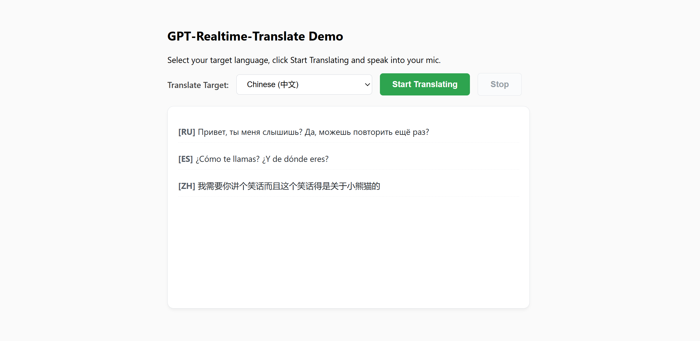

# Azure AI Foundry: Web App for Realtime Speech Translation via WebSocket

This repo demonstrates how to use the **gpt-realtime-translate** model in Microsoft Foundry with server-side *WebSocket* Python proxy and secure *Entra ID* authentication.

> [!TIP]
> Learn more about the GPT-Realtime-Translate on this [Microsoft Foundry documentation page]([https://learn.microsoft.com/en-us/azure/ai-services/openai/how-to/realtime-audio-webrtc](https://learn.microsoft.com/en-us/azure/foundry/openai/concepts/gpt-realtime-translate)).

## 📑 Table of Contents:
- [Part 1: Configuring Solution Environment](#part-1-configuring-solution-environment)
- [Part 2: Backend Implementation](#part-2-backend-implementation)
- [Part 3: Frontend UI](#part-3-frontend-ui)
- [Part 4: Running the Demo](#part-4-running-the-demo)

## Part 1: Configuring Solution Environment

### 1.1 Foundry Setup
Ensure you have a **gpt-realtime-translate** model deployed in your Microsoft Foundry resource. Take a note of your Foundry's resource name and your model's deployment name.

### 1.2 Authentication
The demo utilises passwordless *Microsoft Entra ID* authentication via the `DefaultAzureCredential` provider.

Before running the server locally, log in to your Azure environment using CLI command:

``` PowerShell
az login
```

> [!NOTE]
> Ensure the identity executing this code (your local *Azure CLI* login, *Service Principal* or *Managed Identity*) has been granted at least the **Foundry User** on your Azure AI resource, as described [here](https://learn.microsoft.com/en-us/azure/foundry/concepts/rbac-foundry?tabs=owner%2Cfoundry#minimum-role-assignments-to-get-started).

### 1.3 Environment Variables
Configure the following environment variables in your operating system:

| Environment Variable    | Description                                               |
| ----------------------- | --------------------------------------------------------- |
| FOUNDRY_RESOURCE_NAME   | The sub-domain name of your Foundry resource.             |
| FOUNDRY_DEPLOYMENT_NAME | The exact name of your gpt-realtime-translate deployment. |

### 1.4 Installation
Install the necessary Python packages:

``` Python
pip install fastapi uvicorn websockets azure-identity
```

## Part 2: Backend Implementation
The **app.py** acts as an asynchronous proxy between the client browser and the secure Microsoft Foundry endpoint. It dynamically retrieves *Entra ID tokens* via *get_bearer_token_provider* to authenticate the streaming session over raw WebSockets without exposing API keys.

``` Python
token_provider = get_bearer_token_provider(
    DefaultAzureCredential(), 
    "https://cognitiveservices.azure.com/.default"
)
```

When a frontend connection opens, the backend checks the client's preferred language parameter and initialises the session state via a *session.update* frame.

``` Python
session_update = {
    "type": "session.update",
    "session": {
        "audio": {
            "output": {
                "language": target_language 
            }
        }
    }
}
```

It then starts concurrent tasks to stream binary audio chunks up to Foundry, while sending text delta strings back down to the frontend UI.

``` Python
while True:
    base64_audio = await websocket.receive_text()
    audio_append = {
        "type": "session.input_audio_buffer.append",
        "audio": base64_audio
    }
    await azure_ws.send(json.dumps(audio_append))
```

## Part 3: Frontend UI
The **static/index.html** file manages UI state control via client-side *JavaScript* code. It handles microphone access using *getUserMedia* and uses a *ScriptProcessorNode* downsampler to format input audio into the *24kHz mono PCM* buffer layout required by the model.

``` JavaScript
mediaStream = await navigator.mediaDevices.getUserMedia({ audio: true });
audioContext = new (window.AudioContext || window.webkitAudioContext)({ sampleRate: 24000 });
const source = audioContext.createMediaStreamSource(mediaStream);
processor = audioContext.createScriptProcessor(4096, 1, 1);
```

The app instantiates a fresh, structured paragraph frame each time the user clicks *Start Translating*.

``` JavaScript
ws.onmessage = (event) => {
    const data = JSON.parse(event.data);
    if (data.text && currentParagraphBlock) {
        currentParagraphBlock.appendChild(document.createTextNode(data.text));
        transcriptDiv.scrollTop = transcriptDiv.scrollHeight;
    }
};
```

## Part 4: Running the Demo

### 4.1 Launch the Server
Ensure that **index.html** file is nested inside the **static/** folder alongside your **app.py** execution layer. Then launch the local app's Python stack using your terminal:

``` PowerShell
python app.py
```

### 4.2 Test Live Translation
Open your web browser and enter the following URL:

``` Plaintext
http://localhost:8000/static/index.html
```

Select an output *translate target* from the *languages* drop-down list, click **Start Translating** and begin speaking. Click **Stop** to end the live audio session, clear the state and start a new distinct paragraph.


